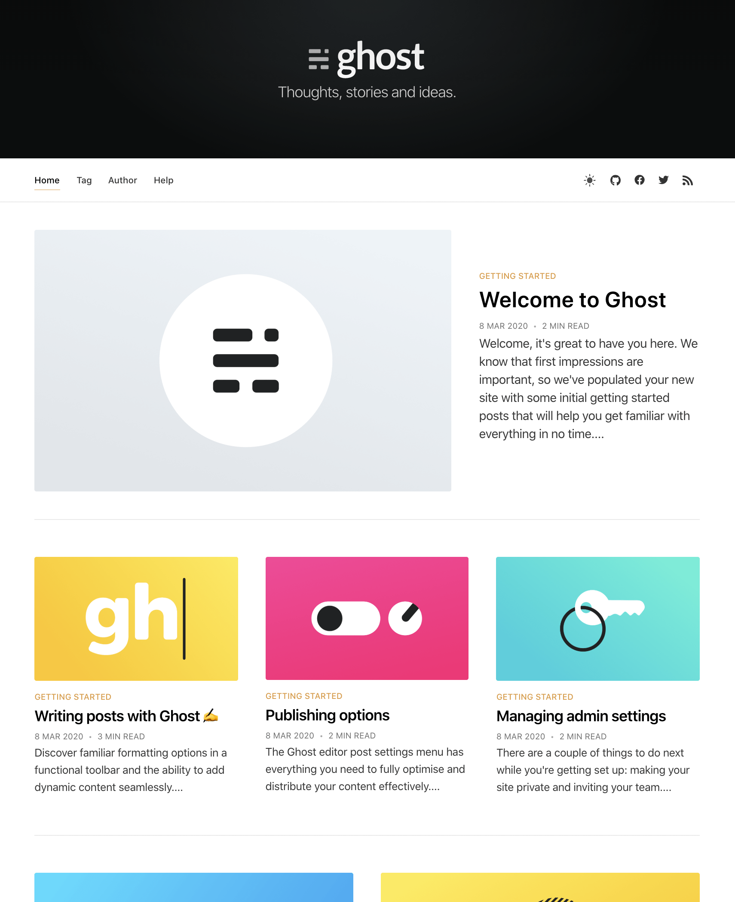
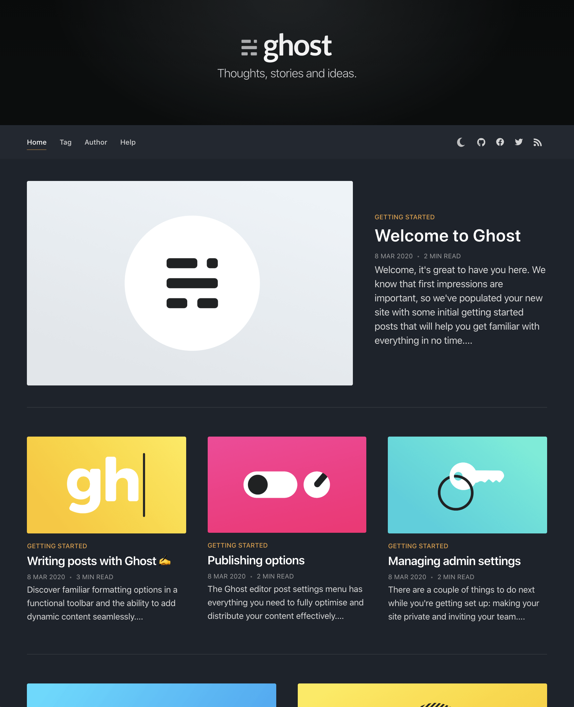
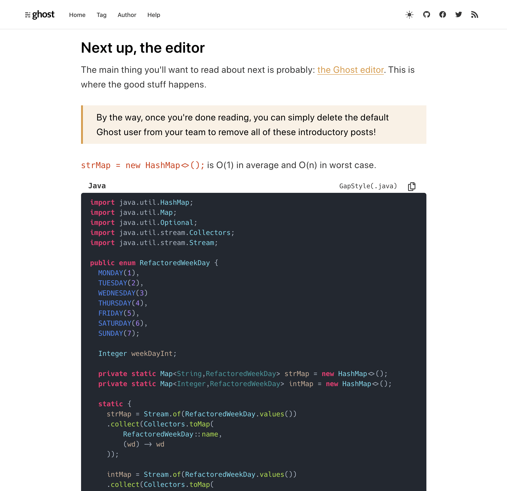
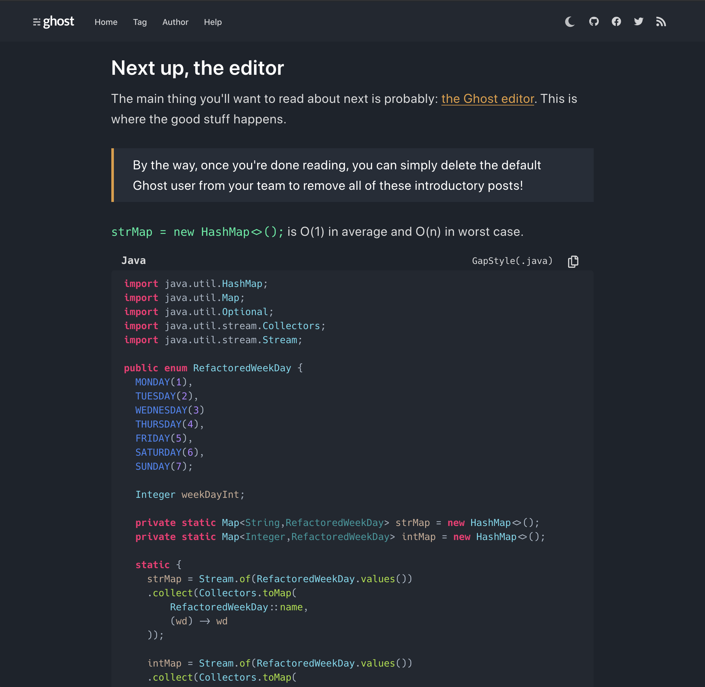

# GapStyle Blog Theme

The default developer blog theme for Ghost 3.0+ and customized with GapStyle and client-side vuejs integration 

|                                                    |                                                  |
| :------------------------------------------------: | :----------------------------------------------: |
|  Index(Light) |  Index(Dark) |
|   Post(Light)  |   Post(Dark)  |

Live Demo

- [https://intl.gaplo.tech (English)](https://intl.gaplo.tech/)
- [https://gaplo.tech (Cantonese)](https://gaplo.tech/)

This project should be a good example to demonstrate how to use Webpack + VueJs + Ghost
HandlerBar SSR together.

# Highlights

- Integrated with Webpack, VueJs and Scss harmony
- Custom implementation of Prismjs syntax highlight to reproduce
  [GapStyle](https://github.com/gaplo917/GapStyle)
- Dark Mode Toggle
- Scss Variable for customization
- Photos Zoom

# TODOs

- support email subscription
- support member registration
- support private content (member system)

# Development

```bash
# install dependencies
yarn install

# run development server
yarn dev

# run production build locally
yarn build

# create deployment secret for release
cp example.secret.json secret.json

# deploy
yarn release
```

# License

MIT
